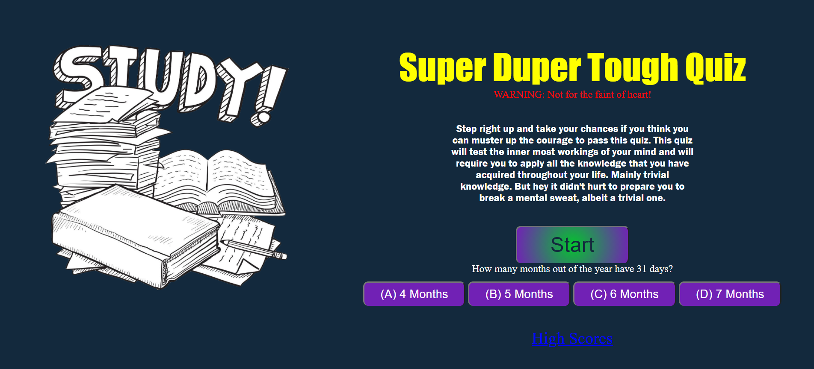
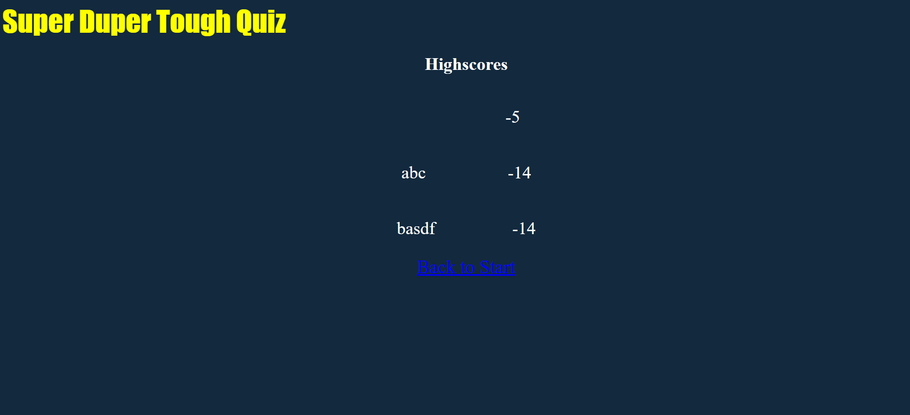

Finished homework assignment for week 4: Coding Quiz Challenge.

Name: Super Duper Tough Quiz

The objective of this week's assignment was to build a timed coding quiz with multiple-choice questions. The quiz will run in the browser and will feature dynamically updated HTML and CSS powered by JavaScript code.  The quiz will have a timer attached to it that allows the user a finite amount of time to finish the quiz. Once the user finishes the quiz or the time has run out, the user will be able to store their high scores using their initials if they so choose. 

Live URL:

https://trevorwiegand92.github.io/Super-Duper-Tough-Quiz/

Github URL:

https://github.com/trevorwiegand92/Super-Duper-Tough-Quiz

Screenshots:

